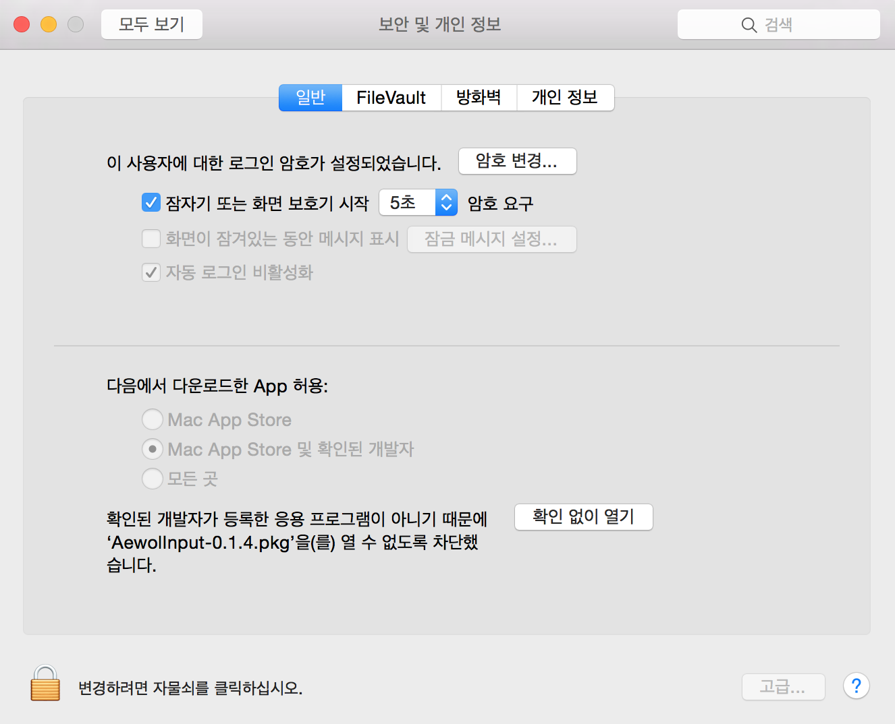

# 애월 입력기

Apple OS X에서 영문 드보락(Dvorak) 자판과 함께 쓸 수 있는 한글 입력기입니다.

> [프로젝트 배경에 대한 상세한(장황한?) 설명](https://medium.com/happyprogrammer-in-jeju/dvorak과-한글-입력기-개발-8940bc4714a1)

### 드보락(Dvorak)?
드보락 자판은 손가락 기본 위치의 가운데 줄에서 70% 타이핑이 일어나기 때문에, 기본 영문 자판인 쿼티(Qwerty)에 비해 적은 움직임과 피로도로 영문을 입력할 수 있습니다.

## 해결하는 문제

한글을 입력하다가도 ```⌘+C```, ```⌘+V```, ```Ctrl+T```등의 조합키를 눌러야할 때가 많습니다. 애플의 기본 입력기에서 한글을 입력하다 이런 조합키를 누르면, 드보락(Dvorak) 입력기를 쓰던 중에도, 쿼티(Qwerty) 레이아웃 기준으로 입력되는 문제가 있습니다.

**애월 입력기**는 기본 입력기와 달리 키보드의 키코드를 기준으로 한글 입력을 처리하기 때문에, 영문 자판으로 쿼티를 쓰든 드보락을 쓰든 문제없이 쓸 수 있습니다.


## 설치하기

1. [최신 패키지 다운로드](https://github.com/hatemogi/AewolInput/releases)
1. 실행해서 시스템에 설치 (보안 경고 확인 필요)
1. 시스템 환경설정 〉 키보드 〉 입력소스 〉 추가(+) 〉 한국어 〉 애월두벌식

최신 패키지를 받아서, 설치하면, ```/Library/Input Methods/``` 디렉토리에 애월입력기 앱(```AewolInputMethod.app```)이 설치됩니다. 설치한 후에, 키보드 환경 설정에서  ```애월 두벌식```입력기를 추가할 수 있습니다.


### 확인되지 않은 개발자 패키지 경고 처리

아쉽게도 아직, Mac개발자 프로그램을 등록하지 않아서, 패키지에 개발자 서명을 하지 못했습니다. 패키지를 설치하려고 하면, **확인되지 않은 개발자가 배포**했다며 경고창이 뜹니다.


개발자 서명을 해서 배포하기 전까지는, ```시스템 환경설정 〉 보안 및 개인 정보 〉 확인 없이 열기``` 기능으로 설치할 수 있습니다.




## 제거하기

현재 별도 제거 프로그램을 제공하지 않고 있습니다. ```시스템 환경설정```에서 ```애월 두벌식```을 제거하신 뒤, ```/Library/Input Methods/AewolInputMethod.app``` 애플리케이션을 수동으로 제거할 수 있습니다.

## 현재 상태

현재 초기 테스트 버전이며, 아직 두벌식 입력만을 지원합니다. 세벌식 모드나 한자 입력은 지원하지 않습니다. OSX 10.10 Yosemite DP7에서 최초 개발했고, 작성자는 El Capitan에서 잘 쓰고 있습니다.


## 알려진 문제

* #4 - 현재 IntelliJ를 비록한 JetBrains사의 애플리케이션(Java AWT 애플리케이션)에서 "애월 입력기 + 드보락" 조합으로 사용하면서 애월 입력기 상태에서 한글외 특수문자(,./;'[] 등)을 입력할 때, 드보락 자판 기준의 문자가 입력되는 문제가 있습니다.

## 감사의 말

* [libhangul]
* [구름입력기]
* [서울서체](http://www.seoul.go.kr/v2012/seoul/symbol/font.html)

이 입력기는 [구름입력기 소스](https://github.com/gureum/gureum)를 참고해서 [libhangul] 라이브러리를 써서 만들었습니다. 아이콘에는 __서울한강체__를 사용했습니다. 해당 소프트웨어를 만들고 공개해주신 분들께 감사드립니다.

## 라이선스

Copyright (c) 2014-2016, [Daehyun Kim](https://github.com/hatemogi).
All rights reserved.

이 프로젝트는 [BSD 라이선스](https://github.com/hatemogi/AewolInput/blob/master/LICENSE)를 따릅니다.

This project is licensed under the terms of the [BSD license](https://github.com/hatemogi/AewolInput/blob/master/LICENSE).

[libhangul]: https://code.google.com/p/libhangul/
[구름입력기]: http://gureum.io
